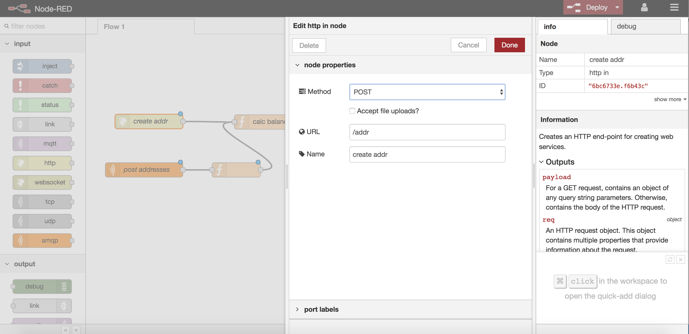
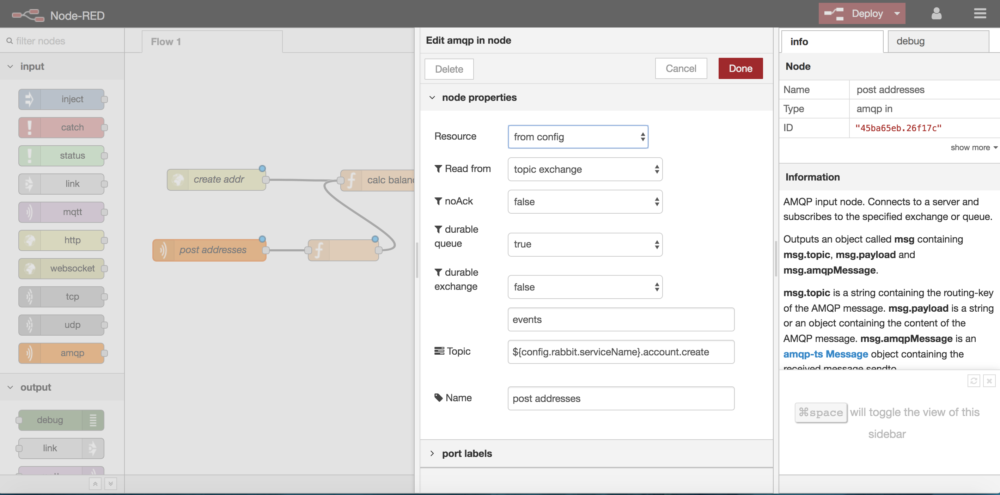
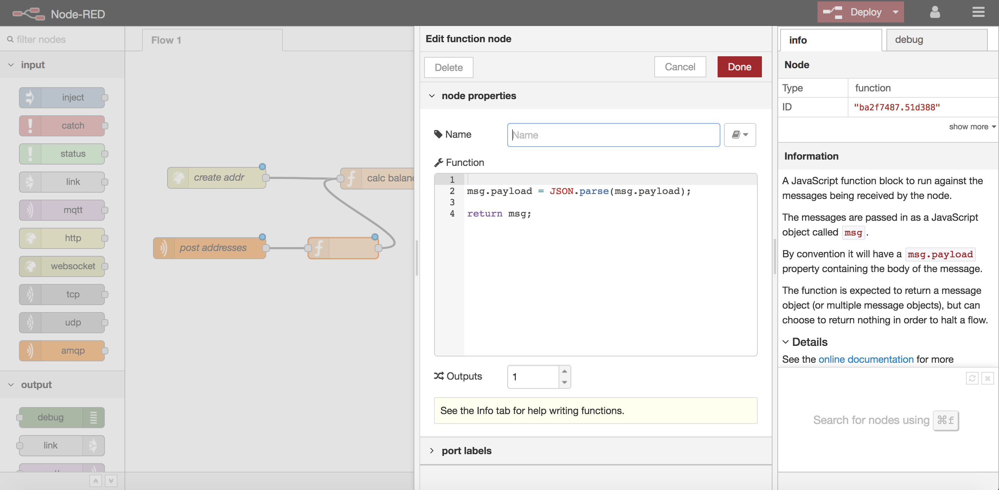
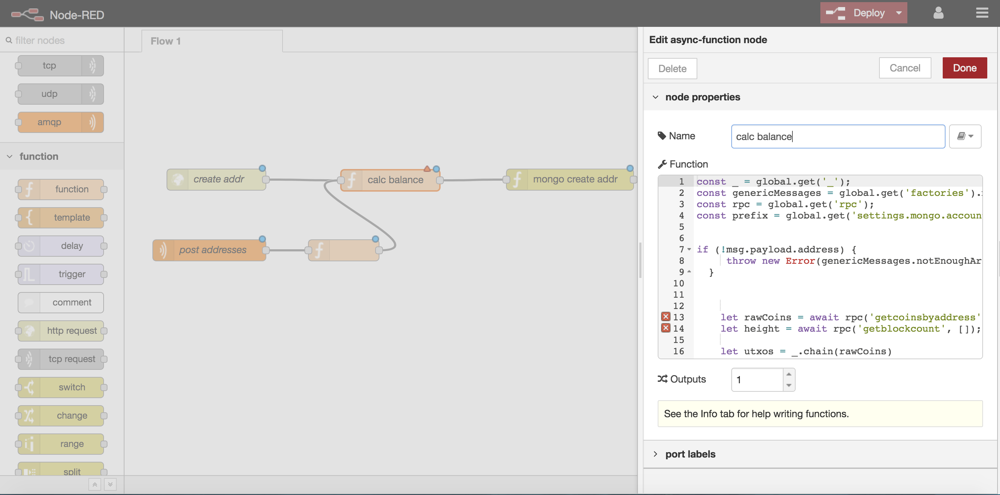
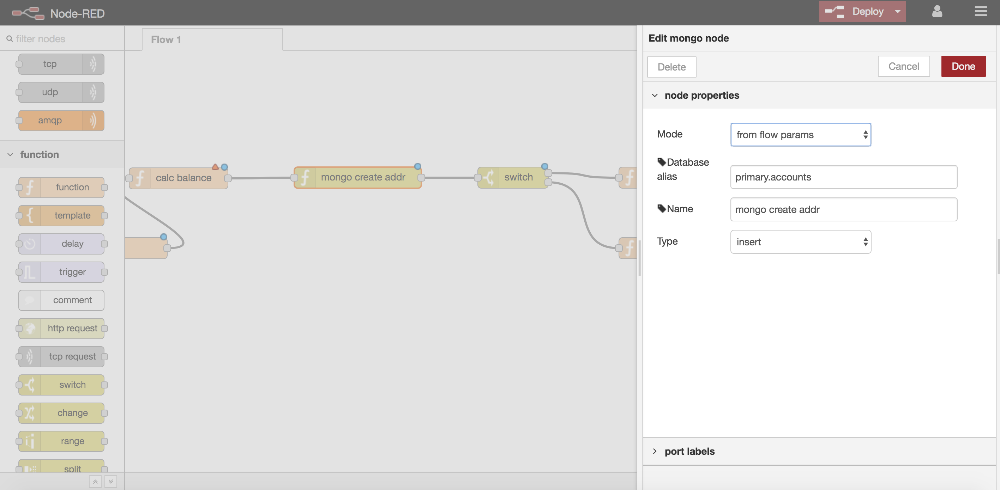
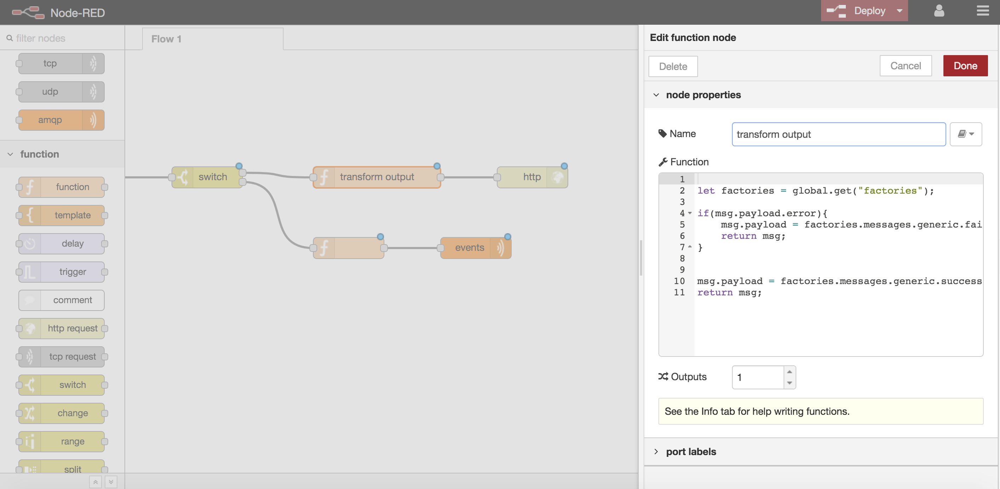
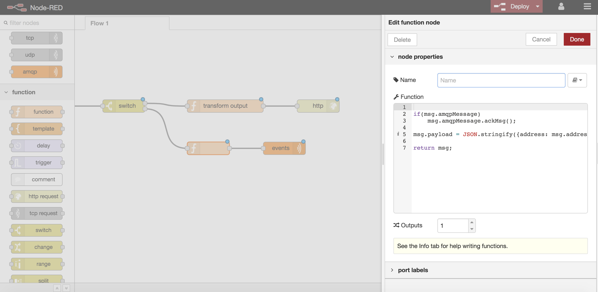
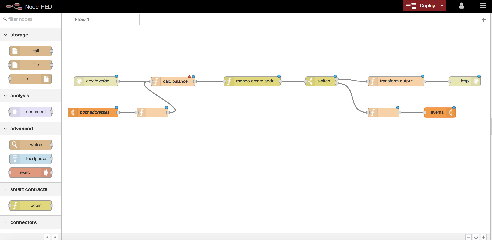

# middleware-service-sdk

Middleware service for which expose rest api

### Installation

This module is a part of middleware services. You can install it in 2 ways:

1) through core middleware installer  [middleware installer](https://www.npmjs.com/package/chronobank-middleware)
2) by hands: just clone the repo, do 'npm install', set your .env - and you are ready to go

#### About

This module works on the basis of Node-Red. As is known, Node-red is  a programming tool for wiring together hardware devices, APIs and online services. Middleware-service-sdk extends the standard sets of components of Node-red such as.

#### New components

| type of node | name of node | description |
| ------------ | ------------ | ----------- |
| input        | amqp         | AMQP input node. Connects to a server and subscribes to the specified exchange or queue
| output       | amqp         | AMQP output node. Connects to a server and delivers the message payload to the specified exchange or queue
| function     | async function| A JavaScript function block to run against the messages being received by th node
| connectors   | mongo        | single mongoose query connector
| utils        | query to mongo | converts query params to mongo like query

#### How it work

This module uses mongoDB as a database. Module creates 3 collections:  migrations, noderedstorage and  nodereduser.
 
Collection 'migrations' keeps id flows which was subjected to migration.
Collection 'noderedstorages' keeps all created flows.
Collection 'noderedusers' keeps information about an admin.

In order to start a service we tentatively need to add an admin`s record to the noderedusers collection. And after that we can start to work.

After deploying your flow it will save in your project, by default it is a folder 'migration'. Also it saves in a database in the noderedstoreges collection.

After service restart, he will upload earlier created flows.

In the event if you need to import your flows in the another database, there is a migration tool in the service-sdk.

#### Example

Let`s make simple API where we can register our new wallet addresses.

Step by step:

1) add 'http end-point' component - it is our request and name it 'create addr'



2) add service-sdk - 'amqp in' component to be connected to the rabbitmq queue/exchange, named it 'post addresses'



3) add 'function' component for the 'amqp in'



4) add 'function' component that will allow us to process the request to add new addresses



5) add service-sdk - 'mongo' component that will save our new record in the mongoDB



6) add 'switch' component that will route messages for respond and event in rabbitmq

7) add 'function' component that will forms the answer for responce



8) add 'function' component that will forms event in rabbitmq



9) Finally, add the 'http responce' and 'amqp out' components, where 'http responce' send responce and 'amqp out' send event to rabbitmq



10) We can deploy our flow 

##### сonfigure your .env

To apply your configuration, create a .env file in root folder of repo (in case it's not present already).
Below is the expamle configuration:

```
MONGO_URI=mongodb://localhost:27017/data
REST_PORT=8081
NODERED_MONGO_URI=mongodb://localhost:27018/data
RABBIT_URI=amqp://localhost:5672

```

The options are presented below:

| name | description|
| ------ | ------ |
| MONGO_URI   | the URI string for mongo connection
| REST_PORT   | rest plugin port
| NODERED_MONGO_URI   | the URI string for mongo collection for keeping node-red users and flows (optional, if omitted - then default MONGO_URI will be used)
| RABBIT_URI  | rabbitmq URI connection string

License
----
 [GNU AGPLv3](LICENSE)

Copyright
----
LaborX PTY